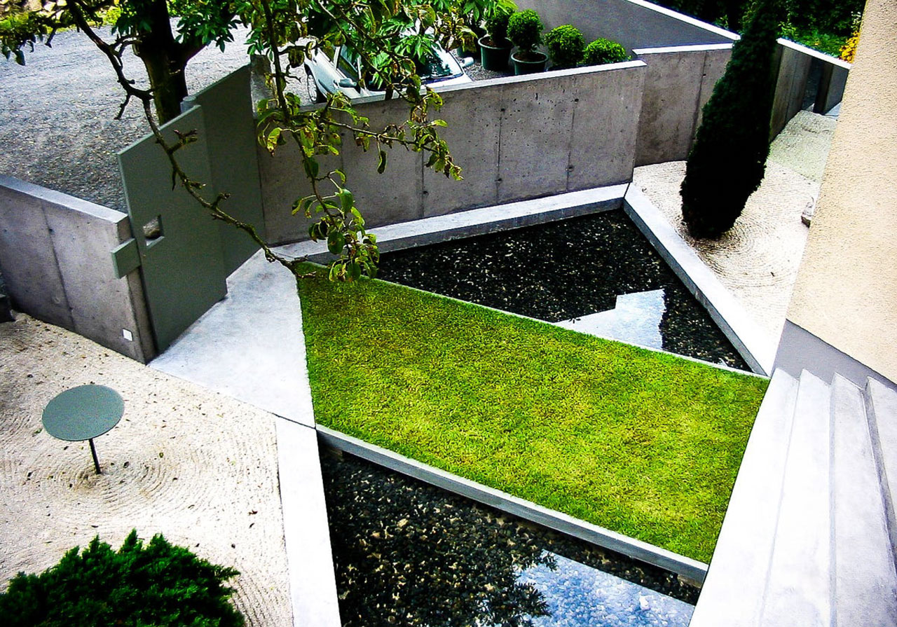
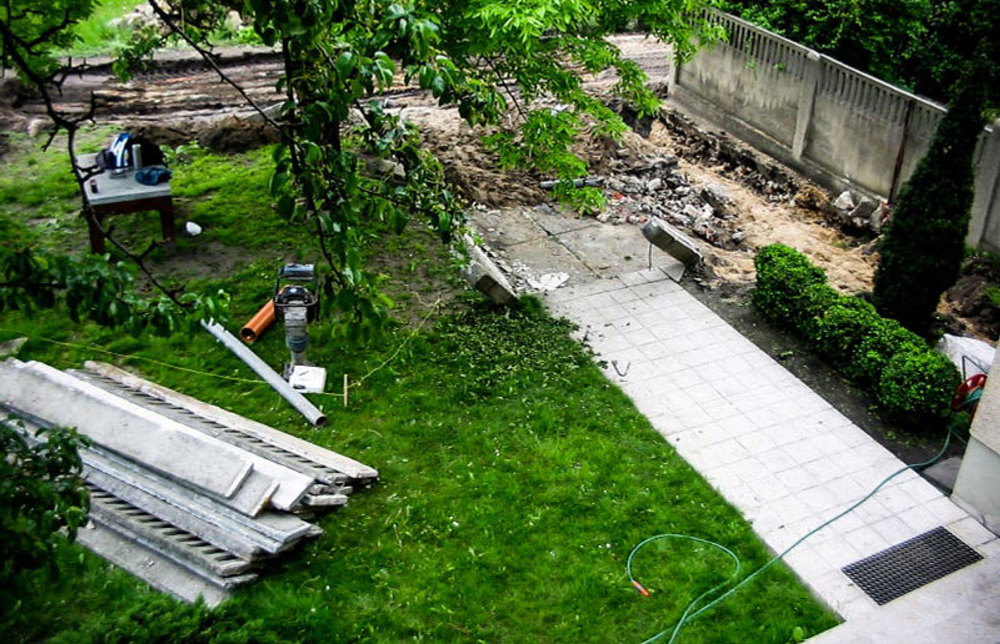
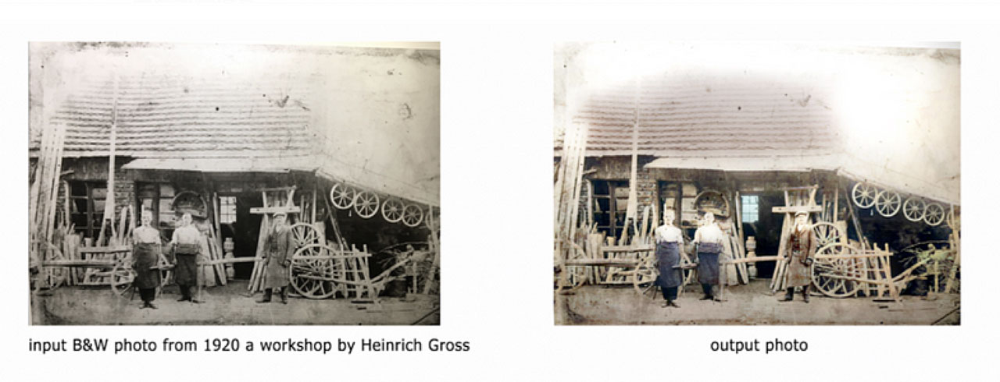
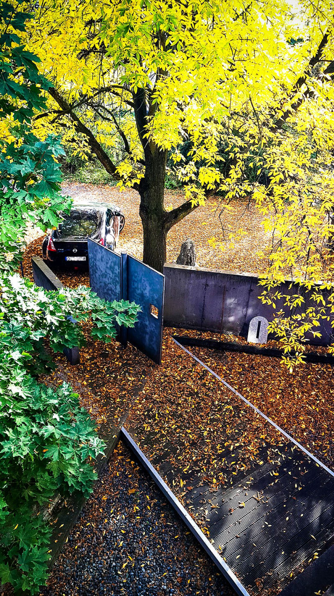

# Sustainable Architecture With AI

## Time and Nature

### Datasculptor's Studio Garden

*july 2004 [Datasculptor's](https://datasculptor.mlearning.ai) studio garden (after)*

**Time and Nature are the two [great sculptors](https://rzezba-gross.pl/) of our world.**

No one would argue that the future of [architecture](https://www.instagram.com/next_top_architects/) is uncertain. Rising global populations, technological advancements, and [climate changes](https://www.instagram.com/p/CV48NfPMp17/?utm_source=ig_web_copy_link&igsh=MzRlODBiNWFlZA==) contribute to a greater understanding of our current challenges. But it is also clear that the need for architectural innovation remains urgent. Inspired by this urgency, this post seeks to update traditional knowledge about building construction with new insights into design-based research in architecture and construction technologies.

Many artists have been working on [architecture](https://www.instagram.com/next_top_architects/), precisely how it relates to the world's changing climate. Architects should consider materials reused to solve this problem, especially ones with a permanent aesthetic value. However, this solution requires a shift in architectural design and lifestyle. This blog post will explore how [architects](https://www.instagram.com/next_top_architects/) can design buildings with a long lifespan and eventually save resources for future generations to use without compromising our [environment](https://www.instagram.com/p/CV48NfPMp17/?utm_source=ig_web_copy_link&igsh=MzRlODBiNWFlZA==).

With so many different components of an entire ecosystem being changed or destroyed by humanity, we must shift [architectural design](https://www.instagram.com/next_top_architects/) from immediate results back toward what promotes permanence- those things that stay around for as long as people are still living on earth — including plants, animals.

*may 2004 [Datasculptor's](https://datasculptor.mlearning.ai) studio garden (before)*

In the summer of 2004, the entrance to my studio was rebuilt. The last entry, built-in 1911 and designed by a wheelwright (my grandfather), was simple and functional. It looked like it could be anywhere, not like in the garden.

It took me 15 years to fully appreciate how incredible the influence of time is and what a difference time makes. It's surprising how much things can change when you give them enough time.

Before designing my new entrance, I researched the history of the area and, in particular, the history of the old entrance. I found it was very telling how the garden had changed over the years, how the lawn and the sand had degenerated, and the garden had become overgrown. In addition, the oldest archived photographs showed [the workshop from 1920.](https://rzezba-gross.pl/)

*[https://rzezba-gross.pl/)*

Reconstruction in 2004 was mainly due to aesthetic reasons. My perspective on aesthetics in [architecture](https://www.instagram.com/next_top_architects/) has changed significantly in 15 years. Aesthetic considerations alone are no longer sufficient to justify [architecture](https://www.instagram.com/next_top_architects/) in today's context. The environmental impact of [architecture](https://www.instagram.com/next_top_architects/) is catastrophic. My fascination with concrete as a material turned into guilt. The tens of thousands of cubic meters of concrete used in my work burden my conscience; my carbon footprint is beyond repair. This can be attested by the example of the garden I designed.

*october 2021 [Datasculptor's](https://datasculptor.mlearning.ai) studio garden*

*Raking sand, meditation. A bridge of grass on water, water as a mirror of the sky, a bridge as a passage to another reality, concrete as a symbol of permanence, a slanted gate as a symbol of changeability, a mirror — infinity.*

And all this without looking at the irretrievable change of the whole ecosystem, the roots of the trees connected, birds with nests, insects, and all the life that has created this place for 100 years. As one of the billions of living beings on earth, what right do we have to subordinate everything to ourselves without regard for the environment's good?

> **What right do we have to disturb the harmony of nature?**

[The climate crisis](https://deepecology.substack.com/) is a reality, and [machine learning](https://www.linkedin.com/company/mlearning-ai) and blockchain technologies will help with the amount of data and minimize [the impact on the environment](https://www.instagram.com/p/CV48NfPMp17/?utm_source=ig_web_copy_link&igsh=MzRlODBiNWFlZA==). But, unfortunately, we all, artists, [architects,](https://www.instagram.com/next_top_architects/) and ordinary mortals, tend to disregard the permanency of buildings. They come and go; they move; they collapse and lie fallow for long periods. But the materials they are made, the stone, wood, iron, and concrete, stay. And if we are lucky, they survive for future generations to use.

None of us can be sure what will happen to the world in the future. But let's take a conservative approach and assume that there is no all-powerful deity, no miracle cure for the many diseases of the planet, and no way to predict or prevent catastrophes like flooding or drought. Instead, it seems clear that our future is one of the massive population increases, massive migrations from regions affected by [climate change](https://www.linkedin.com/company/mlearning-ai) toward safer areas with sufficient food and water supplies. In other words, this is a future with millions of [climate](https://www.linkedin.com/company/mlearning-ai) refugees, people on the move across continents because their homes have been rendered unlivable.

Time for a paradigm shift in [architecture](https://www.instagram.com/next_top_architects/), aesthetics — yes, but not at the cost of the environment.

> **Each material used should be cataloged and available for reuse.**

A repository should be available to all users, like a library or museum, with different material classes. The aesthetic value of the material would be irrelevant.

Artificial intelligence will help find the best solutions for each project at hand — what [architecture](https://www.instagram.com/next_top_architects/), materials, and technology to use? Data collection is key to producing these models. All our buildings are changing because the changing aesthetics and technologies will help maintain data integrity across generations.

> This can be done by cataloging buildings through time — concretely showing their lifespan through changes in architecture and aesthetics. All this will allow future generations to **use our databases** to improve upon what we did before them.

My garden hasn't changed much since the remodeling. The sand on the lawn is packed and covered with leaves. Yet, the garden is still bustling with life — vines, bushes, birds, and trees — a wonderful place to sit and contemplate the beautiful world around us.

The [Datasculptor's](https://datasculptor.mlearning.ai) garden is built of concrete and stones. He doesn't need any more materials to live a peaceful life for the next century.

Permanence is what we need not only for buildings but also for the [environment](https://www.instagram.com/p/CV48NfPMp17/?utm_source=ig_web_copy_link&igsh=MzRlODBiNWFlZA==). By making buildings more sustainable through [architecture](https://www.instagram.com/next_top_architects/) and [machine learning](https://www.linkedin.com/company/mlearning-ai), we can find solutions to our ongoing [climate crisis](https://deepecology.substack.com/) while respecting the permanency of the natural environment.

> **Time and Nature** are the two [great sculptors](https://rzezba-gross.pl/) of our world. Only eternity will look back and judge our actions.

---

By [Dariusz Gross #DATAsculptor](https://datasculptor.mlearning.ai) on November 4, 2021.
